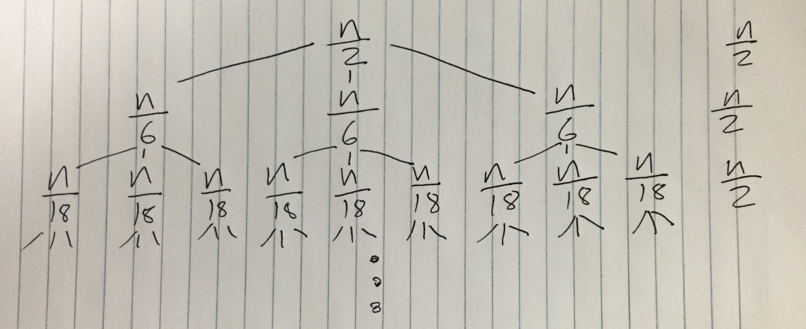
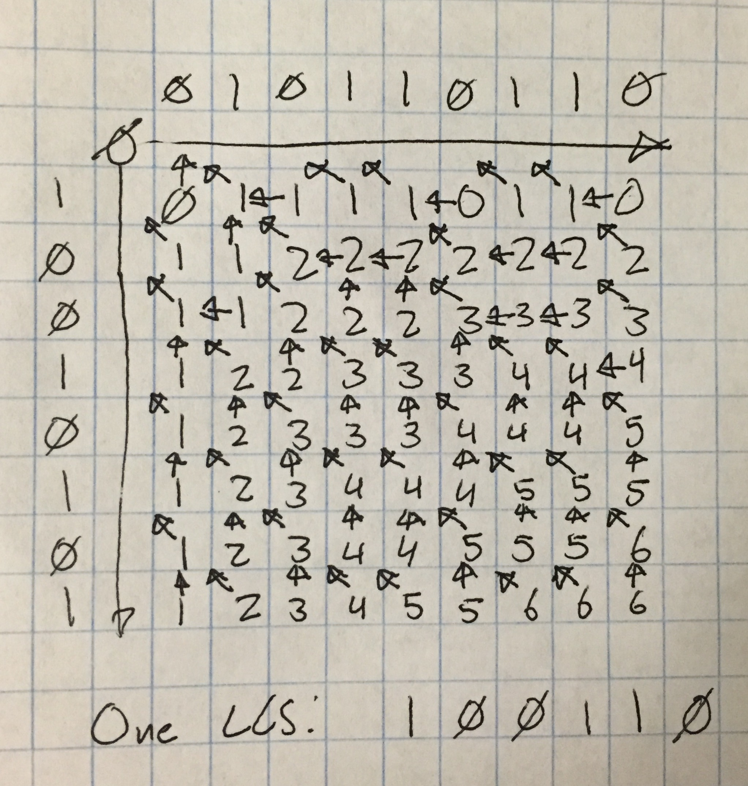
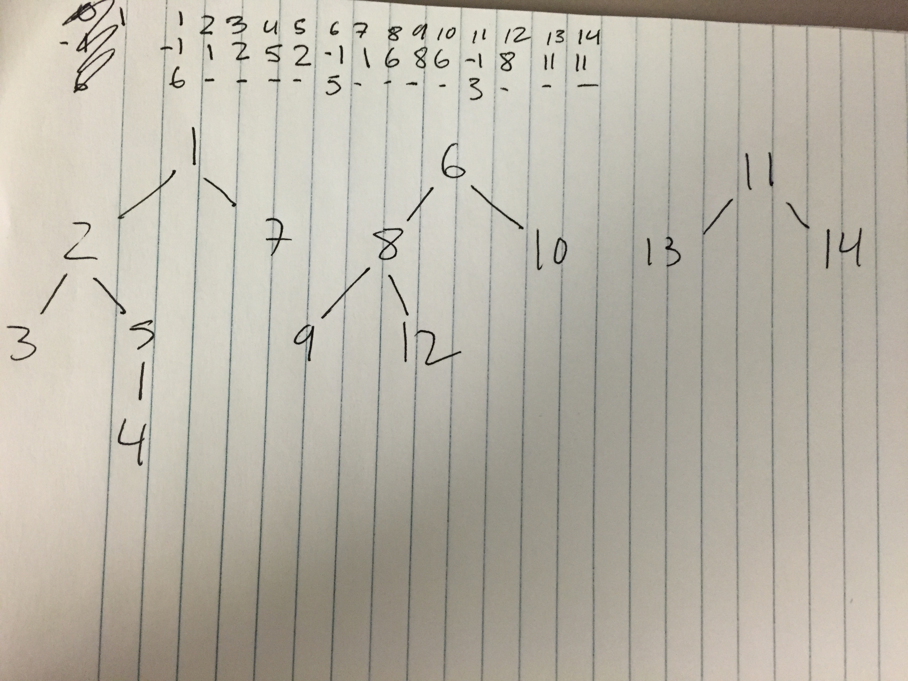
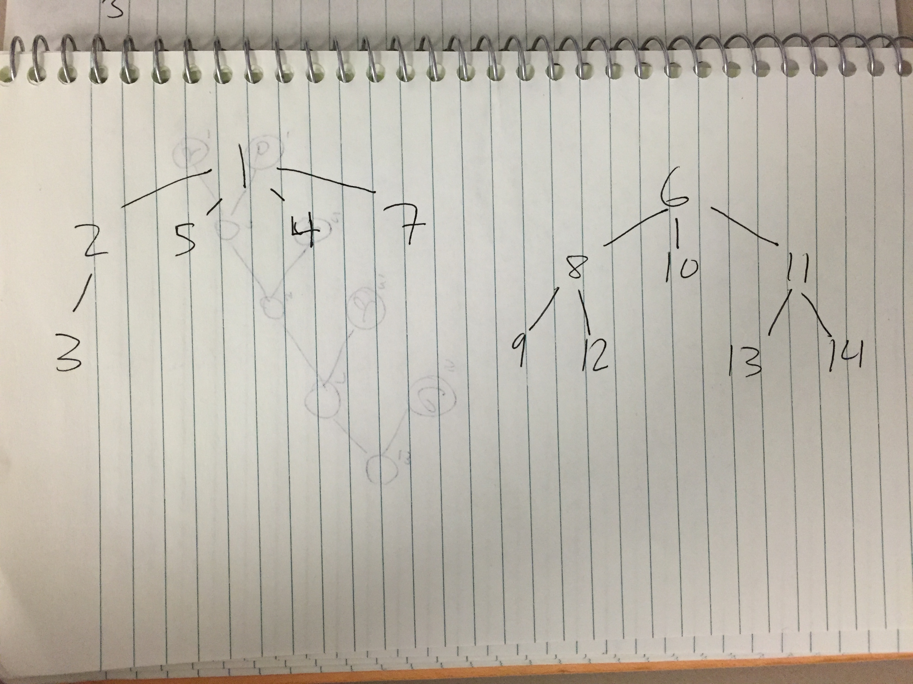

DS16 Final  
Noah Weiner

# 1 (5 pts each)

**a)** a = 3, b = 4, f(n) = n log n  
Case 3: f(n) = omega(n^log(3 + e, 4) for e > 0  
so **T(n) = O(n log n)**

**b)** a = 3, b = 3, f(n) = n/2  
Case 2: f(n) = theta(n^1)  
so **T(n) = O(n log n)**

**c)** a = 4, b = 2, f(n) = n/logn  
Case 1: f(n) = O(n^(2 - e)) for e > 0  
so **T(n) = O(n^2)**

# 2 (15 pts)

**a)** 

**b)** It looks like each level is the same amount of work: n/2, and its length is
log n, so T(n) would likely be O(n log n)

**c)**  
3T(n/3) + n/2  
3(3T(n/9) + n/2) + n/2  
3(3(T(n/27) + n/2) + n/2) + n/2  
3(3(3(T(n/91) + n/2) + n/2) + n/2) + n/2)

**d)** O(n log n) was the same answer I received from the Master theorem.

# 4 (15 pts)

**Divide and conquer: mergesort.** The algorithm is a classic divide-and-conquer:
it divedes a list into two halves to be sorted and merged back together.

**Greedy: Huffman encoding.** At each step, the two smallest tree's are chosen
to be merged. The result of choosing the optimum solution at each step is that
the lightest-weight nodes end up at the lowest depths of the tree.

**Dynamic programming: Least common substring.** In order to avoid repeating work,
a table is used to store the result of previous solutions.

# 7 (20 pts)

Exactly like the hint says, use a stack. Use a 1 followed by a symbol to push
that symbol to the stack and a 0 to combine the top two trees on the stack,
similar to postfix expressions.

For figure 10.11, the header could be (with spaces added for clarity):

```
1s 1nl 0 1t 0 1a 0 1e 0 1i 1sp 0 0
```

# 9 (10 pts)

See figure



# 11 (20 pts)

**a)** See figure



**b)** See figure



# 12 (20 pts)

a. s, G, D, H, A, E, B, I, F, C, t

b. A stack can result in slightly different ordering, since if you traverse
adjacent vertices in the same order, they will be popped in reverse order
relative to a dequeue.